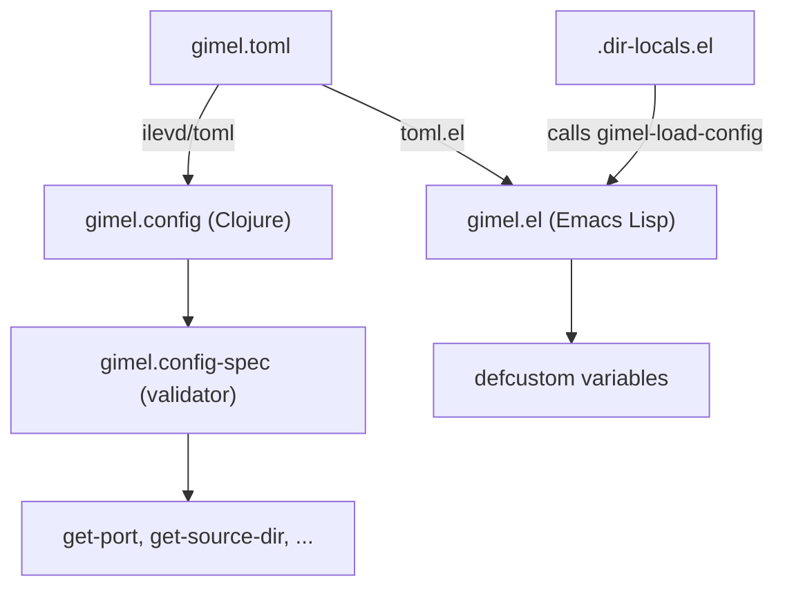

# Design Document: TOML Configuration Migration

## Overview

This feature replaces the existing EDN-based configuration (`resources/config/gimel.edn`) with a single `gimel.toml` file that both the Clojure backend and the Emacs Lisp frontend can read. The `.dir-locals.el` file is updated to call a new `gimel-load-config` function rather than hard-coding values.

The key goals are:
- One authoritative config file for all settings
- No duplication between backend and Emacs frontend
- Backward-compatible Clojure accessor API (no changes to callers)
- Clean error messages at startup when config is missing or invalid

### Key Decisions

**Clojure TOML library**: `ilevd/toml` (wraps the Java `toml4j` library). It supports `:keywordize` to produce keyword-keyed maps directly, and it supports `toml/write` for round-trip testing. Added to `project.clj` dependencies.

**Emacs TOML library**: `toml.el` (`gongo/emacs-toml`). Declared as a `Package-Requires` dependency in `gimel.el`. Parses TOML into alists. The `[server]`, `[database]`, and `[emacs]` tables become nested alists keyed by string.

---

## Architecture

The migration touches three areas:

1. **Config file** — `resources/config/gimel.toml` replaces `resources/config/gimel.edn`
2. **Clojure backend** — `gimel.config` is updated to parse TOML and reshape the result into the existing map structure expected by `gimel.config-spec`
3. **Emacs frontend** — `gimel.el` gains `gimel-load-config`; `resources/org/.dir-locals.el` is updated to call it



---

## Components and Interfaces

### 1. `resources/config/gimel.toml` (new file)

The single shared configuration file. Replaces `gimel.edn`.

```toml
[server]
port           = 8080
web-url        = "https://naurrnen.selfdidactic.com"
webroot        = "resources/public"
source-dir     = "resources/html"
sitemap-source = "resources/src"
template       = "resources/templates/html5-page-layout"
footer         = "Powered by Gimel"

[database]
dbname = "gimel.db"

[emacs]
source-path  = "org"
target-path  = "html"
navbar-file  = "navbar.org"
auto-publish = false
```

### 2. `gimel.config` (Clojure — updated)

**New dependency**: `[ilevd/toml "0.1.0"]` in `project.clj`.

The namespace gains a `parse-toml` private function that:
1. Reads the TOML file using `toml/read` with `:keywordize`
2. Reshapes the flat keywordized map into the nested structure `{:configuration {:public {...} :database {...}}}` that `gimel.config-spec/check-config` expects

The `load-config` function is updated to call `parse-toml` instead of `read-edn`. The fallback resource path changes from `config/gimel.edn` to `config/gimel.toml`.

All existing public accessor functions (`get-port`, `get-source-dir`, `get-webroot`, `get-web-url`, `get-template-dir`, `get-footer`, `get-dbname`, `get-sitemap-source`) remain unchanged in signature and return type.

**TOML → Clojure map reshaping**:

| TOML key | Clojure path |
|---|---|
| `server.port` | `:configuration :public :port` |
| `server.web-url` | `:configuration :public :web-url` |
| `server.webroot` | `:configuration :public :webroot` |
| `server.source-dir` | `:configuration :public :source-dir` |
| `server.sitemap-source` | `:configuration :public :sitemap-source` |
| `server.template` | `:configuration :public :template` |
| `server.footer` | `:configuration :public :footer` |
| `database.dbname` | `:configuration :database :dbname` |

The `[emacs]` table is parsed but not stored in the Clojure config atom (it is only consumed by the Emacs frontend).

### 3. `gimel.el` (Emacs Lisp — updated)

**New dependency**: `(toml "1.1.0.0")` added to `Package-Requires`.

New `defcustom` variable:

```elisp
(defcustom gimel-config-file
  (expand-file-name "~/.config/gimel/gimel.toml")
  "Path to the gimel TOML configuration file."
  :type 'file
  :group 'gimel)
```

New public function:

```elisp
(defun gimel-load-config (toml-path)
  "Load gimel.toml from TOML-PATH and populate defcustom variables.
Signals an error if the file does not exist or contains invalid TOML.
Does not modify any variable if an error occurs."
  ...)
```

Behaviour:
- Signals `(error "gimel-load-config: file not found: %s" toml-path)` if the file does not exist; no variables are modified.
- Calls `toml:read-from-file` inside a `condition-case`; if it signals an error, re-signals with a descriptive message; no variables are modified.
- On success, sets:
  - `gimel-api-endpoint` ← `(format "http://localhost:%d" (cdr (assoc "port" server-table)))`
  - `gimel-source-path` ← `(cdr (assoc "source-path" emacs-table))`
  - `gimel-target-path` ← `(cdr (assoc "target-path" emacs-table))`
  - `gimel-navbar-file` ← `(cdr (assoc "navbar-file" emacs-table))`
  - `gimel-auto-publish` ← `(cdr (assoc "auto-publish" emacs-table))` (boolean: `t` or `nil`)
- Returns the full parsed alist.

### 4. `resources/org/.dir-locals.el` (updated)

```elisp
;;; Directory Local Variables
;;; For more information see (info "(emacs) Directory Variables")

((nil . ((gimel-config-file . "/path/to/project/gimel.toml")
         (eval . (gimel-load-config gimel-config-file)))))
```

`gimel-config-file` is overridden here to point to the project-local `gimel.toml`. If omitted, `gimel-load-config` falls back to the default `~/.config/gimel/gimel.toml`. No other values are hard-coded.

---

## Data Models

### `gimel.toml` schema

| Table | Key | Type | Description |
|---|---|---|---|
| `[server]` | `port` | integer (positive) | HTTP listen port |
| `[server]` | `web-url` | string (`http(s)://...`) | Public base URL |
| `[server]` | `webroot` | string (non-empty) | Static file root |
| `[server]` | `source-dir` | string (non-empty) | HTML source directory |
| `[server]` | `sitemap-source` | string (non-empty) | Sitemap source directory |
| `[server]` | `template` | string (non-empty) | Template directory path |
| `[server]` | `footer` | string (non-empty) | Footer text |
| `[database]` | `dbname` | string (non-empty) | SQLite database filename |
| `[emacs]` | `source-path` | string | Org source subdirectory |
| `[emacs]` | `target-path` | string | HTML output subdirectory |
| `[emacs]` | `navbar-file` | string | Navbar org filename |
| `[emacs]` | `auto-publish` | boolean | Auto-publish on save |

### Clojure internal config map (unchanged shape)

```clojure
{:configuration
 {:public
  {:port           8080
   :web-url        "https://..."
   :webroot        "..."
   :source-dir     "..."
   :sitemap-source "..."
   :template       "..."
   :footer         "..."}
  :database
  {:dbname "..."}}}
```

This shape is validated by `gimel.config-spec/check-config` (unchanged).

---

## Correctness Properties

*A property is a characteristic or behavior that should hold true across all valid executions of a system — essentially, a formal statement about what the system should do. Properties serve as the bridge between human-readable specifications and machine-verifiable correctness guarantees.*

### Property 1: TOML parse produces spec-valid config map

*For any* combination of valid server and database config values (positive port, valid URL, non-empty strings), writing those values into a TOML string and parsing it through `parse-toml` SHALL produce a Clojure map that passes `check-config` without throwing.

**Validates: Requirements 2.3, 3.1, 3.2, 3.3, 3.5**

### Property 2: Config round-trip equivalence

*For any* valid Clojure config map, serialising it to TOML with `toml/write` and then parsing it back through `parse-toml` SHALL produce a map equivalent to the original.

**Validates: Requirements 2.7**

### Property 3: Invalid config always throws

*For any* config map that is missing at least one required key or has an invalid value (non-positive port, malformed URL, empty string for a required field), calling `check-config` SHALL throw an `ex-info` whose message identifies the offending key.

**Validates: Requirements 2.5, 3.1, 3.2, 3.3, 3.4**

### Property 4: Accessor values match TOML input

*For any* valid config map loaded via `load-config`, the value returned by each accessor function (`get-port`, `get-source-dir`, `get-webroot`, `get-web-url`, `get-template-dir`, `get-footer`, `get-dbname`, `get-sitemap-source`) SHALL equal the corresponding value in the input map.

**Validates: Requirements 7.3, 2.6**

### Property 5: `gimel-load-config` populates all defcustom variables

*For any* valid `gimel.toml` content with arbitrary port, source-path, target-path, navbar-file, and auto-publish values, calling `gimel-load-config` SHALL set each defcustom variable to the value from the TOML file, with `gimel-api-endpoint` constructed as `"http://localhost:<port>"`.

**Validates: Requirements 4.3, 4.4, 4.5, 4.6, 4.7**

### Property 6: `gimel-load-config` is idempotent

*For any* valid `gimel.toml` file, calling `gimel-load-config` twice on the same file SHALL leave all defcustom variables in the same state as calling it once.

**Validates: Requirements 4.10**

---

## Error Handling

### Clojure backend

| Condition | Behaviour |
|---|---|
| Config file path does not exist | Fall back to classpath `config/gimel.toml`; if that also fails, throw `ex-info` |
| TOML syntax error | Catch exception from `toml/read`, throw `ex-info {:error <message>}` |
| Spec validation failure | `check-config` throws `ex-info {:error <spec-explain>}` |
| `get-*` called before `load-config` | Throw `ex-info "Config is blank!!!"` (existing behaviour, unchanged) |

### Emacs frontend

| Condition | Behaviour |
|---|---|
| File does not exist | `(error "gimel-load-config: file not found: %s" path)` — no variables modified |
| TOML parse error | Re-signal with `(error "gimel-load-config: TOML parse error in %s: %s" path msg)` — no variables modified |

The Emacs implementation uses a two-phase approach: validate preconditions first, then parse and assign. This ensures atomicity — either all variables are set or none are.

---

## Testing Strategy

### Clojure tests (`test/gimel/`)

**Unit / example tests** (`config_test.clj`, `config_spec_test.clj`):
- Load a known `gimel.toml` fixture and assert each accessor returns the expected value
- Call each accessor on an empty atom and assert `ex-info "Config is blank!!!"` is thrown
- Call `load-config` with a non-existent path and assert the bundled default is loaded
- Assert the bundled `resources/config/gimel.toml` parses without error

**Property-based tests** (`config_property_test.clj`):

Uses `clojure.test.check` (already in `project.clj` as `[org.clojure/test.check "1.1.3"]`). Each property test runs a minimum of 100 iterations.

- **Property 1** — Generate random valid config values via `gen/such-that` generators; assert `check-config` does not throw.
  - Tag: `Feature: toml-config-migration, Property 1: TOML parse produces spec-valid config map`
- **Property 2** — Generate random valid config maps; serialize with `toml/write`, parse back, assert equivalence.
  - Tag: `Feature: toml-config-migration, Property 2: Config round-trip equivalence`
- **Property 3** — Generate invalid config maps (remove a random required key, or set port to 0 or negative, or set URL to a non-URL string); assert `check-config` throws `ex-info`.
  - Tag: `Feature: toml-config-migration, Property 3: Invalid config always throws`
- **Property 4** — Generate random valid config maps; load via `load-config`; call each accessor; assert values match input.
  - Tag: `Feature: toml-config-migration, Property 4: Accessor values match TOML input`

### Emacs tests (`resources/emacs/tests/gimel-test.el`)

Uses `ert` (already used in the existing test file).

**Example tests**:
- `gimel-load-config` with a valid temp TOML file returns an alist
- Each accessor variable is set to the expected value after `gimel-load-config`
- `gimel-load-config` with a non-existent path signals an error and leaves variables unchanged
- `gimel-load-config` with invalid TOML signals an error and leaves variables unchanged

**Property-based tests** (`resources/emacs/tests/gimel-property-test.el`):

Uses the `propcheck` Emacs Lisp property-testing library (or alternatively, a simple hand-rolled generator loop with `dotimes` for 100 iterations, since Emacs PBT libraries are less mature). Each property test runs 100 iterations.

- **Property 5** — Generate random port numbers (1–65535), source-path, target-path, navbar-file strings, and auto-publish booleans; write to a temp TOML file; call `gimel-load-config`; assert all defcustom variables match.
  - Tag: `Feature: toml-config-migration, Property 5: gimel-load-config populates all defcustom variables`
- **Property 6** — Generate random valid TOML configs; call `gimel-load-config` twice; assert defcustom variables are identical after both calls.
  - Tag: `Feature: toml-config-migration, Property 6: gimel-load-config is idempotent`

### Migration smoke tests

- Assert `resources/config/gimel.edn` does not exist
- Assert `resources/config/gimel.toml` exists and is valid TOML
- Assert `gimel.config` source contains no reference to `gimel.edn`
- Assert `.dir-locals.el` calls `gimel-load-config` and contains no hard-coded config values
