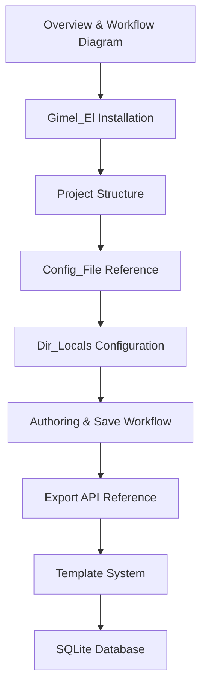

# Design Document: Workflow Documentation

## Overview

This document describes the design for a comprehensive user guide covering the end-to-end gimel workflow. The output is a single org-mode file (`docs/guide.org`) that walks authors and operators through every aspect of using gimel: installing `gimel.el`, structuring a project, configuring the server, authoring org-mode content, triggering exports, customising templates, and understanding the SQLite database. Org-mode is the natural format for this project given that gimel is built around an org-mode authoring workflow.

The documentation is a static prose artifact — not a software component. Its "architecture" is therefore an information architecture: how sections are ordered, what each section covers, and how cross-references between sections are maintained.

---

## Architecture

The guide is a single, self-contained Markdown document. It is structured as a progressive disclosure narrative:

1. A high-level workflow overview (the big picture first)
2. Installation and setup (getting started)
3. Reference sections for each subsystem (config, dir-locals, authoring, API, templates, database)

This ordering mirrors the mental model of a new user: understand what gimel does → install it → configure it → use it daily → extend or integrate it.



Each section is self-contained enough to be read in isolation (for reference use), but the ordering supports a linear first-read experience.

---

## Components and Interfaces

The documentation describes the following system components and their interfaces:

### Gimel_Server
- Started via `lein run` or an uberjar
- Reads `gimel.edn` (default: `~/.config/gimel/gimel.edn`; override with `--config <path>`)
- Exposes an HTTP API on the configured `:port`
- Serves static files from `:webroot`
- Routes: API requests take priority over static file serving; unmatched paths return 404

### Gimel_El
- An Emacs Lisp package (`gimel.el`) loaded into Emacs
- Configured per-project via `.dir-locals.el`
- Hooks into `after-save-hook` when `gimel-auto-publish` is non-nil and the buffer is `org-mode`
- Communicates with Gimel_Server via `GET /api/export`

### Org_File → HTML_Snippet pipeline
- Input: `.org` file in `gimel-source-path`
- Split point: first line matching `^\*+ ` (first org heading)
- Metadata_Section → YAML frontmatter (via `gimel-org-metadata-to-yaml`)
- Body_Section → HTML fragment (via `org-export-as 'html`)
- Output: `.html` file in `gimel-target-path` with `---` delimited frontmatter prepended

### Export pipeline
- Input: `.html` snippets in `:source-dir`
- Frontmatter parsed by `parse-header` (SnakeYAML via cybermonday)
- Pages rendered through Template using Enlive selectors from `template.edn`
- Assets fingerprinted by Optimus
- Output written to `:webroot` by Stasis
- SQLite database created/populated during export

---

## Data Models

### Config_File (`gimel.edn`)

```edn
{:configuration
 {:public
  {:sitemap-source "path/to/org-files"   ; source of .org files for sitemap generation
   :source-dir     "path/to/html-snippets" ; where Gimel_El writes .html snippets
   :webroot        "path/to/public"       ; where Gimel_Server writes the rendered site
   :template       "resources/templates/html5-page-layout" ; path to template directory
   :footer         "Copyright Me © 2026"  ; footer text injected into every page
   :web-url        "https://example.com"  ; canonical base URL
   :port           8080}                  ; HTTP port for Gimel_Server
  :database
  {:dbname "gimel.db"}}}                  ; SQLite database filename
```

### Dir_Locals (`.dir-locals.el`)

```elisp
((nil . ((gimel-auto-publish . t)
         (gimel-api-endpoint . "http://localhost:8080")
         (gimel-source-path  . "/path/to/org-files")
         (gimel-target-path  . "/path/to/html-snippets")
         (gimel-navbar-file  . "navbar.org"))))
```

### HTML_Snippet format

```
---
title: "My Page Title"
tags:
  - clojure
  - web
---
<h1 id="my-page-title">My Page Title</h1>
<p>Page body HTML...</p>
```

### Template directory structure

```
<template-dir>/
├── index.html      # Base HTML layout (Enlive template)
├── template.edn    # CSS selector mappings for content injection
├── style.css       # Stylesheet (fingerprinted by Optimus)
└── script.js       # JavaScript (fingerprinted by Optimus)
```

### `template.edn` format

```edn
{:body
 {:navbar  [:header [:nav]]          ; CSS selector for navbar injection
  :main    [:section#pageContent [:main]]  ; CSS selector for page body injection
  :footer  [:footer]}}               ; CSS selector for footer injection
```

### SQLite database schema

**`pages` table**
| Column  | Type         | Notes                        |
|---------|--------------|------------------------------|
| id      | INTEGER PK   | Auto-increment               |
| url     | VARCHAR(128) | Page path, UNIQUE            |
| title   | VARCHAR(128) | From frontmatter `title` key |
| content | TEXT         | Raw HTML body                |

**Per-metadata-key tables** (e.g., `tags`, `author`)
| Column | Type        | Notes              |
|--------|-------------|--------------------|
| id     | INTEGER PK  | Auto-increment     |
| name   | VARCHAR(64) | Metadata value, UNIQUE |

**Join tables** (e.g., `tags_lnk`)
| Column  | Type    | Notes                        |
|---------|---------|------------------------------|
| page    | INTEGER | FK → pages.id                |
| `<key>` | INTEGER | FK → `<key>`.id              |

---

## Error Handling

The documentation must cover the following error and edge-case scenarios so users can diagnose problems:

| Scenario | Behaviour to document |
|---|---|
| `gimel.edn` not found at default path | Server falls back to `resources/config/gimel.edn` bundled in the jar |
| `gimel.edn` parse error | Server prints error to stdout and exits |
| `GET /api/export` — server unreachable | `gimel-export` logs an error message in the `*Messages*` buffer |
| HTML_Snippet has no frontmatter | `partial-pages` logs a warning; page renders with a red `NO META DATA` heading |
| `POST /api/export-custom` with missing/invalid fields | Returns HTTP 400 with `{"error": "Invalid input data"}` |
| Unrecognised API path | Returns HTTP 404 with `{"error": "API endpoint not found"}` |
| `gimel-batch-process-org-files` | Deletes entire Source_Dir before processing — data loss if paths are misconfigured |

---

## Testing Strategy

This feature produces a documentation artifact (a Markdown guide), not executable code. Property-based testing is not applicable because:

- There are no pure functions with varying inputs to test
- All acceptance criteria are documentation content/completeness requirements
- The "correctness" of documentation is verified by human review against the requirements checklist

**Testing approach:**

1. **Manual review against requirements checklist** — each acceptance criterion in `requirements.md` is checked off against the finished document. This is the primary quality gate.

2. **Accuracy verification** — code examples (EDN, Elisp, shell commands) are verified by running them against the actual codebase. Specifically:
   - The `gimel.edn` example is validated against `resources/config/gimel.edn` and `src/gimel/config_spec.clj`
   - The `.dir-locals.el` example is validated against `resources/emacs/gimel.el` variable definitions
   - The `template.edn` example is validated against `resources/templates/html5-page-layout/template.edn` and `src/gimel/templates.clj`
   - API endpoint paths and response codes are validated against `src/gimel/api/core.clj`
   - Metadata conversion rules are validated against `gimel-org-metadata-to-yaml` in `gimel.el`

3. **Link and reference integrity** — all cross-references within the document (e.g., "see the Config_File section") resolve to actual section headings.

4. **Glossary consistency** — every term defined in the requirements glossary appears in the guide with a consistent definition.
